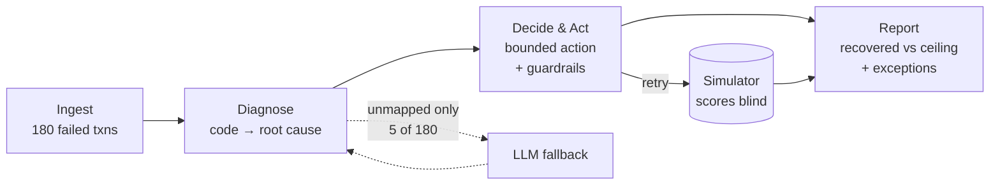

# RecoverAI — Architecture

An agent that ingests failed payments, diagnoses each failure's root cause,
executes a bounded recovery action, and reports **measured** money recovered
alongside an honest list of what it could not.

Organised around the four judging criteria rather than the code layout. Each
section states the decision first, then the reasoning.

---

## 1. The loop — *Problem Taste*

**Decision: four stages, each with one job, and a closed set of actions.**



The merchant has already won the customer; the money is lost to a decline
code. So the unit of work is a rupee recovered, not a retry attempted.

Nine root causes, eight actions. **Nothing outside the action list can
execute** — the executor throws if a decision produces an action not in the
enum, making the boundary a runtime guarantee rather than a convention.

| Root cause | Action | Auto-retry |
|---|---|---|
| `INSUFFICIENT_FUNDS` | `SCHEDULED_RETRY` near a credit event | ≤3 |
| `BANK_DOWNTIME` | `RETRY_AFTER_WINDOW` (2h) | ≤3 |
| `UPI_TIMEOUT` | `IMMEDIATE_RETRY` | ≤2 |
| `AUTH_ABANDONED` | `RECOVERY_LINK_ALT_METHOD` | never |
| `MANDATE_INVALID` | `REAUTH_LINK` | never |
| `CARD_EXPIRED` / `INVALID_INSTRUMENT` | `UPDATE_INSTRUMENT_REQUEST` | never |
| `RISK_BLOCKED` / `UNKNOWN` | `ESCALATE_HUMAN` | **never** |

Timing carries the domain judgement: a drained account is still drained an
hour later, so `INSUFFICIENT_FUNDS` retries are scheduled toward a likely
salary credit. *When* matters more than *whether* for that cause.

---

## 2. Rules first — *AI Judgment*

**Decision: decline codes resolve by lookup. The LLM sees only codes the
taxonomy cannot map — 5 of 180 records, 2.8%.**

`U69` is NPCI for insufficient balance. `CARD_EXPIRED` is not a judgement
call. For these a lookup is correct every time, costs microseconds, and cannot
fail. Routing them through a model would add latency, per-token cost, and an
outage that stops diagnosis entirely — while introducing non-determinism into
a decision that has a right answer. The same code could classify differently
across runs, which is indefensible in anything touching money.

**Where the model earns its place:** real gateways emit codes no taxonomy
anticipates. This batch seeds `ERR_BAL_LOW_RETRY_LATER` and
`DEBIT_FAILED_ACCT_BAL`. Rules return `UNKNOWN`; the model reads the string
and proposes a cause — an ambiguous-language problem, which is what models are
good at and lookup tables are not.

Three constraints keep it safe:

- **Cannot invent a diagnosis.** Output is validated against the root-cause
  enum; off-list answers are discarded and the record stays `UNKNOWN`.
- **Cannot choose an action.** It proposes a *cause*; the executor applies the
  same policy and guardrails as any rules-diagnosed record. The model never
  reaches the money.
- **Is measured.** The report records records seen, resolved, and
  inconclusive.

It resolves all 5 and adds **3 recoveries** over rules-only. Small, real, and
attributable — the honest argument for using one at all.

---

## 3. Hidden ground truth — *Problem Taste + Build Quality*

**Decision: every transaction carries a `_truth` block the agent is
structurally forbidden from reading.**

The most important decision in the project. Without it, "money recovered" is
self-fulfilling: retry everything, count the wins, report a number with no
denominator.

`_truth.would_recover_on_retry` decides whether a retry would *actually* have
succeeded. The scorer reads it; the agent never does. That gives the batch a
real ceiling — 71 transactions, ₹2,12,456 — and turns the headline into a
capture rate against a bound the agent cannot influence.

`_truth` also carries *which attempt* a recovering payment lands on. That is
what gives the stopping rules teeth: 7 transactions worth ₹38,698 would only
have recovered on a 4th attempt, and the 3-attempt cap puts them permanently
out of reach. **That cost is reported, not hidden.** A guardrail that never
costs anything is not a guardrail.

**The containment test** — verifiable, not asserted:

```bash
npm run verify:truth
```

It scans `src/`, strips comments so docblock mentions don't count, and fails
if any file outside the two permitted ones reads `_truth`. Current result:
`generator.js` (writes it) and `simulator.js` (grades against it). Classifier,
executor, dispatcher, LLM layer, metrics and runner are clean — **the agent
decides blind.**

**The honest limitation.** The per-cause probabilities — 42% for insufficient
funds, 61% for UPI timeout, 4% for a dead instrument — are **my modelling
assumptions, not observed data.** Directionally defensible (intent was present
in a timeout; a closed account is closed), but not measured, and the absolute
rupee figure inherits that uncertainty. They are stated in the generator
rather than buried. What the design *does* establish is that the agent cannot
game the metric, regardless of how well those numbers are calibrated.

---

## 4. Safety rails — *Build Quality*

**Decision: guardrails are enforced above per-cause policy, so no policy
change can weaken them.**

**Never auto-retry.** `RISK_BLOCKED` and `UNKNOWN` carry `maxAttempts: 0`,
checked before anything else runs. Auto-retrying a risk block could push a
fraudulent payment through; acting on an undiagnosed cause is worse than not
acting. Dead instruments are never retried either — the destination cannot
succeed, so retrying only burns gateway calls.

**Value cap, relative not absolute — 60% of the batch's at-risk total,**
computed at run start. It guards against a runaway agent: a classifier
regression that maps everything to "retry" and fires at a merchant's entire
failed volume in one pass, turning a quiet leak into a live gateway incident
and duplicate debits.

Relative beats absolute because a flat figure is wrong at every scale but one
— it never fires on a small batch and strangles a large one. The original flat
₹5,000 throttled a ₹6.25L batch after nine retries. `--cap-value` overrides it
per run, so the rail can be *demonstrated* engaging rather than taken on
faith.

The cap counts each transaction **once**, on its first attempt: retrying the
same ₹5,000 payment three times does not put ₹15,000 at risk, since only one
attempt can succeed. Counting per attempt triple-counted exposure and made a
"60%" ceiling behave like ~20%, silently suppressing recoveries.

**Attempt cap** 3 per transaction, globally. **Message cap** 2 per customer
per day — the most-triggered rail, and the one standing between a recovery
agent and spam.

Every decision, trip, dispatch and outcome appends to
`data/audit_log.jsonl` — ~1,080 events per run, one JSON object per line,
readable with no service running.

---

## 5. Failure recovery — *Failure Recovery*

**Decision: the LLM is pure upside. It can add recoveries; it cannot break a
run.**

The fallback is not an error handler bolted on afterward — it is the system's
normal behaviour. Before the LLM existed, unmapped codes escalated to a human.
That is a *correct outcome*, so an unavailable model degrades the agent to
exactly what it did before, and the batch still completes.

| Failure | Behaviour |
|---|---|
| No API key / `--no-llm` | Reports `off`, unmapped codes escalate |
| Timeout or HTTP error | Record stays `UNKNOWN`, escalates |
| Off-list answer | Discarded, stays `UNKNOWN` |
| 3 consecutive failures | **Breaker opens**, later calls skip the network |

Transient errors (429, 5xx) retry twice with backoff before counting as a
failure — tripping the breaker on a free-tier capacity spike would discard
available recoveries. Permanent errors (4xx) fail immediately; they never
self-heal. All paths verified, recovery identical in each:

```bash
npm start -- --no-llm                        # rules only
GEMINI_API_KEY=invalid node src/index.js     # breaker opens, run completes
```

---

## 6. Results

180 failed transactions, ₹6,25,155 at risk.

| | |
|---|---|
| **Recovered** | **₹1,37,932 across 50 transactions** |
| Recoverable ceiling (hidden truth) | 71 txns / ₹2,12,456 |
| Capture rate | 70.4% of txns, 64.9% of value |
| Of what the attempt cap leaves reachable | 50/64 — **78.1%** |
| Cost of the attempt cap | 7 txns / ₹38,698, unreachable by design |
| Retries fired · escalated · exceptions | 234 · 6 · 130 |

Rules alone recover 47. The LLM's 5 calls add 3.

| Cause | Seen | Retried | Won | Rate | Recovered |
|---|---|---|---|---|---|
| `INSUFFICIENT_FUNDS` | 60 | 148 | 23 | 16% | ₹61,901 |
| `UPI_TIMEOUT` | 25 | 40 | 13 | 33% | ₹38,995 |
| `BANK_DOWNTIME` | 23 | 46 | 14 | 30% | ₹37,036 |
| `AUTH_ABANDONED` | 22 | 0 | — | — | link issued |
| `MANDATE_INVALID` | 22 | 0 | — | — | re-auth link |
| `CARD_EXPIRED` / `INVALID_INSTRUMENT` | 22 | 0 | — | — | instrument request |
| `RISK_BLOCKED` | 6 | 0 | — | — | escalated |

Zero-retry rows are the safety rails working, not gaps in coverage.

| Exception reason | Txns | Value |
|---|---|---|
| `retries_exhausted` | 58 | ₹1,91,372 |
| `awaiting_customer:RECOVERY_LINK_ALT_METHOD` | 22 | ₹1,34,188 |
| `awaiting_customer:UPDATE_INSTRUMENT_REQUEST` | 22 | ₹1,30,801 |
| `awaiting_customer:REAUTH_LINK` | 22 | ₹23,831 |
| `NEVER_AUTO_RETRY` | 6 | ₹7,031 |

Exceptions are first-class output. `retries_exhausted` is the largest bucket:
payments tried three times that genuinely were not recoverable. A recovery
agent that reports only its wins should not be trusted.

---

## 7. Out of scope — and why

**Real SMS/WhatsApp delivery.** Messages are generated and logged with
`delivered: false`. Delivery is an integration problem, not a judgement one,
and a logged message is auditable where a sent one is not.

**Real payment collection.** Retries resolve against a simulator, not a live
gateway. The most significant limitation: the decision logic is complete, but
no money has moved. The simulator sits behind one seam, so a test-mode call
substitutes without the decision path changing.

**MongoDB.** Originally in the stack. Dropped because the audit trail is
*evidence* — a reviewer should clone and read it with no service to install
and no connection to fail. The writer sits behind an `open/write/close`
interface, so a database adapter is one file.

**React dashboard.** Replaced by a generated self-contained HTML file, for the
same reason: a build step and a dev server are two more things that can fail
during evaluation.

**Multi-tenant auth, scheduling, model training.** Not required to demonstrate
the loop, and each adds surface area to a system whose argument is that it
does one thing completely.

**Hinglish messages.** Built last, cut first — isolated in the message layer.
The criteria measure recovery and judgement, not message copy.
